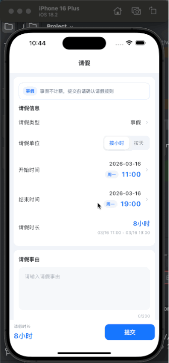

# Stack Magic Demo

一个围绕 Flutter `Stack` 组件编写的演示工程，适合作为文章配套 demo 或讲解素材。

### 文章地址[]

### 展示图

## 包含内容

- 基础叠加
- `alignment` 与 `Positioned` 绝对定位
- 头像在线状态
- 商品卡片角标
- 悬浮按钮与全屏蒙层
- `StackFit.loose / StackFit.expand`
- `IndexedStack` 状态保留
- `AnimatedPositioned` 动画定位

## 两种浏览模式

- `交互演示`
  用来实际点击和观察 Stack 行为，适合边讲边演示。
- `文章配图`
  把核心场景重排成更完整的海报式卡片，适合直接截图插入文章。
